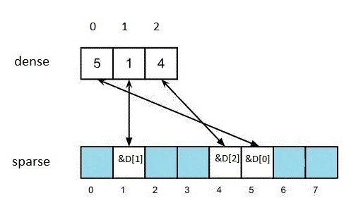
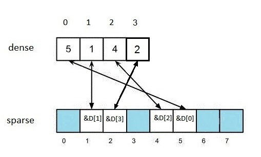
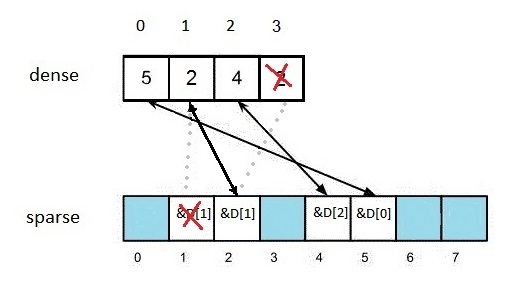
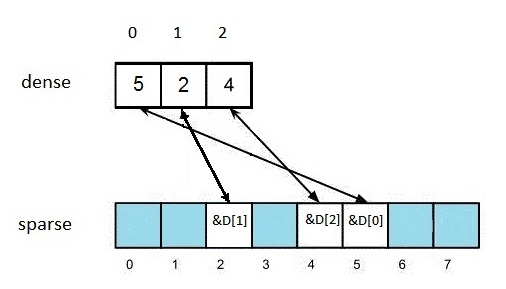
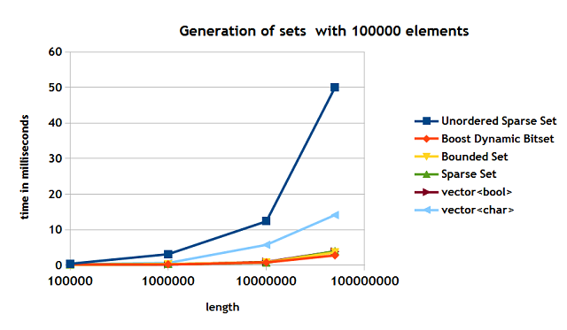
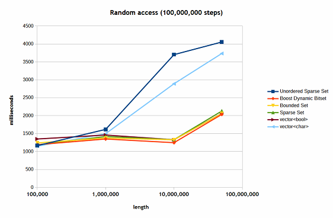
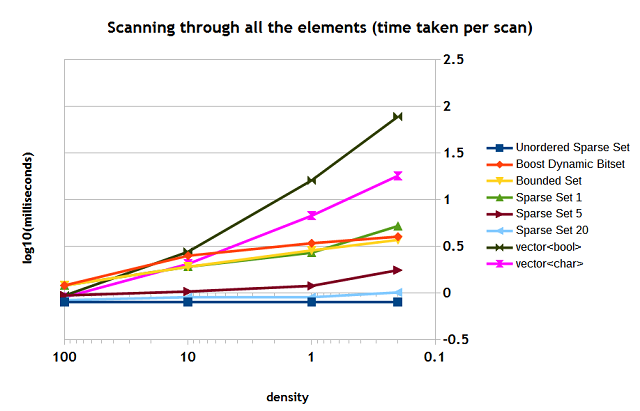
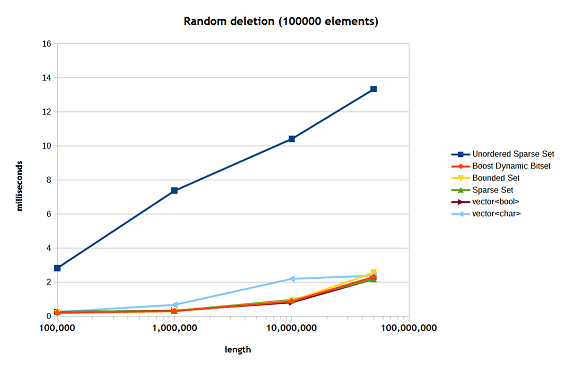

# [Fast Implementations of Sparse Sets in C++](https://www.codeproject.com/Articles/859324/Fast-Implementations-of-Sparse-Sets-in-Cplusplus)

## Introduction

Working on one of the tasks, I have encountered a simple problem: finding the best method for dealing with a selection of array indices. The issue is: if you want simple selection of indices, you may wish do put extra boolean field in each element or create a vector of bool. But if this selection is quite sparse, the iteration through all the elements will be slow. Obviously, in this case an array of indices can be generated. But then there is an issue with updating this array: even if a sorted array is not needed, it is faster to search through a sorted array (to avoid duplication of elements). But inserting an element into a sorted array is pricey.

I this article I will be covering three implementations of sparse sets of integers, comparing them with existing containers, including the Boost dynamic bitset.

The code was tested in Microsoft Visual  C++ 14 CTP, GNU C++ 4.9 and Clang C++ 3.5.

## What Containers Shall We Consider?

Let's look at the list of existing containers we may wish to consider. The obvious ones in C++11 [1] are: std::vector<bool>, std::bitset. Since std::vector<bool> uses internally a collection bits, it would be wise to compare is against a collection of bytes: for instance, std::vector<char>.

Although std::set<T> designed for various types, not only integers and is not that efficient. But it would be appropriate to consider it. I like it's design: it provides a convenient iterator, which allows to scan through the “selected” elements. And, in general, I think its collection of methods is the most appropriate. In contrast, std::vector<bool> provides an iterator, but it scans through all the elements (true and false), instead of only the “selected” ones (whose values are true). The std::bitset container does not have an iterator. There is also the Boost dynamic bitset, which is similar to to std::bitset: it does not have an iterator, but provides methods for fast scanning through the selected elements.

You may wish to look at the BitMagic bitvector as well [3]. I am not going to discuss it in this article.

## Proposed Design of Sparse Set Containers

As I mentioned before, I consider the std::set<T> design the most appropriate in terms of the methods and iterators provided. The following generic structure of a sparse set is proposed: the size and  count methods have a different meaning than in the std::set container; the test method is added.

```
class generic_sparse_set
{
public:

//----------------------------------
// Types
// ----------------------------------
    typedef ... value_type;
    typedef ... size_type;
    typedef  ... iterator;
    typedef  ... const_iterator;    

///------------------------------------
/// Constructors
///------------------------------------
            
    generic_sparse_set(size_type size); // creating a sparse set with elements in the interval [0,size-1]

    generic_sparse_set(); // creating a sparse set; space is not reserved, requires resize.

///------------------------------------
/// Modifiers
///------------------------------------
    void resize(size_type size); // reserve the space for elements in the interval [0,size-1]

    void swap(generic_sparse_set& s); // swap the contents with another sparse set

    bool insert(value_type i); // insert an element; returns true if a new element is inserted;
                               // returns false if the same element is already in the set.

    void erase(value_type i);  // delete an element by value
   
    void erase(const iterator& it); // optional method; deletes an element by iterator   

    void clear(); // deletes all the elemnts   

///------------------------------------
/// Capacity
///------------------------------------
    size_type size() const; // the length of the interval that the elements can be taken from

    size_type count() const; // the number of elements

///------------------------------------
/// Operations
///------------------------------------
 
    bool test(value_type i) const;  // test if an element is in the set

    bool empty() const; // tests if a set is empty

    const_iterator find(value_type i) const; // optional; finds an iterator for an element

    const_iterator lower_bound(value_type i) const; // optional; returns an iterator pointing to
                                                     //  the first element that is >= i

    const_iterator upper_bound(value_type i) const;  // optional; returns an iterator pointing to
                                                      //  the first element that is > i

///------------------------------------
/// Iterators
///------------------------------------
    const_iterator begin() const; // returns an iterator to the beginning

    const_iterator end() const;   // returns an iterator pointing the past-the-end of the container
};
```
Some methods are mentioned as optional: they may be inefficient to use or simply inappropriate (for example, using lower_bound for an unordered sequence). The iterator and constant iterator are the same classes: you can only scan through the elements of the set, you cannot change them while scanning.

## Sparse Set Implementations Provided

###### The Unordered Sparse Set

This container is based on the article [4]. A good explanation of the algorithm is given in [5].

The implementation consists of two arrays (for instance, std::vector containers): one is sparse (an array of pointers), another is dense  (or D) (an array of indices). In a value v is in the set, sparse[v] ==&dense[k], where dense[k] == v. In other words, *(sparse[v]) == v. But the index k is unimportant. In does not matter, what the value of the index is as long as, dense[k] = v.

A sample set, containing three values: 1,4 and 5 is shown in Figure 1.



The blue squares in the picture are nullptr values. Notice two important qualities:

 * testing for presence of a value is easy: sparse[value] != nullptr;
 * iterating through elements is easy as well: iterate through the array dense; this is the fastest iteration you can ever get.
  
Let us consider the algorithm for adding an extra element e, where, for instance,  e=2 (Figure 2)



We perform dense.push_back(e). Then we perform sparse[e] = &dense.back();

Deletion is quite easy as well.  We would like to delete element k = 1 (Figure 3).



When we handle the dense array we always delete the last element, which, in this case, contains 2. But we need to replace the value in the that we try to delete. So, *(sparse[1]) = dense.back(). This, means that now: dense[1] == 2. We have to adjust the value in sparse[2]: in general terms, we have to perform:

sparse[dense.back()] = sparse[1];

After that, as all the necessary links are established, we can delete the elements:

dense.erase(dense.end()-1);

sparse[1] = nullptr;

We now get the state of the arrays as shown in Figure 4.



One final remark: although I do not consider sorting the dense array, it is possible to sort its elements. The necessary swap(i,j) algorithm can be easily written:

```
std::swap(sparse[dense[i]],sparse[dense[j]]);
std::swap(dense[i],dense[j]);
```
Using this swap, sorting can be easily implemented.

###### The Bounded Set

This implementation is very close in functionality and speed to the Boost dynamic bitset. The difference is in the methods provided. The basic idea is that the values are stored as bits in an array (call it bit_array) of some base type. If, for example, the base type is a 32-bit integer, in order to test whether the i-th element is present one can write the following code:
```
bool test(value_type i)
{
     return ((bit_array[i >> 5] >> (i & 0x1F)) & 1) != 0;
}
```

The implementation provides an iterator, which quickly skips zero bits.

This is obviously the most compact and rather efficient implementation. But scanning through the elements using the iterator is not as fast as in the unordered sparse set.

###### The Sparse Set

This container tries to combine the best features of both containers discussed above: the efficiency and compactness of the bounded set with the fast iteration of the unordered sparse set.  The basic approach is the same as in the bounded set, but the iterator is different.  When an iterator is needed, a vector of integers is quickly constructed from the bit array. The advantages are as follows:

 * if it is necessary to iterate several times (usually over 5 times) through all the existing values, the combined time of such scans start approaching that of the unordered sparse set;
 * even when there is only one scan the timing is very close to that of the bounded set (or that of the Boost dynamic bitset);
the elements are ordered (in contrast to the unordered sparse set);
 * it is more efficient (except for scanning using an iterator) than the unordered sparse set (generation, testing for availability, deletion).

## Benchmarks

###### Overview
For benchmarks, I have considered mainly the following containers: unordered_sparse_set, sparse_set, bounded_set, boost::dynamic_bitset, std::vector<bool>, std::vector<char>.   In some tests, I looked at std::bitset and std::set<unsigned> as well. But the former is rather limited in terms of the range of values (I looked at the VC++ 2014 and GCC 4.9) that is can handle and, in general, slower than std::vector<bool>. The latter is simply rather slow. I have included their tests in the sample code, but I won't discuss them much.

The following tests were considered:

 * creation of a container from prestored randomly generated numbers (with various densities;  the density is the ratio of the number of available elements to the length of the iterval; it's is usually expressed in percents);
 * random access;
 * repeatedly scanning through all the elements (number of scans considered: 1, 5, 20);
 * deletion of the elements using prestored numbers.
  
In order to make sure that we compare like with like, the number generator was reset in each test.

The results were obtained in Microsoft Visual C++ 14 CTP compiled for 32-bit.


###### Generation of elements

The results are shown in Figure 5. The highest length used in the tests was 50,000,000.



The timing for the bounded set, std::vector<bool>, sparse set are parctically the same. The Boost dynamic bitset is rather close as well.  The unordered sparse set shows the slowest time. It is due to the size of the data structures is uses and the complexity of adding a element. Both the unordered sparse set and std::vector<char> seem to be affected by the cache issues.


###### Random Access

The nature of all the containers is question is such that random access does not depend on the number of elements, but only on the length of the intervals involved and the number of steps (trials). In Figure 6, you can see the results of benchmarks with 10,000,000 steps for various lengths of the intervals.



Here again, as before, the unordered sparse set shows the worst performance, especially  when the length is above 1,000,000, followed by the std::vector<char>. The issue here is only cache: the random test code is  very simple. You may notice that they perform practically the same as other containers when the interval length is about 100,000.

You may ask the question: why do we consider the unordered sparse set at all? It hasn't so far shown better performance than other containers.  I would suggest you read the next section.

## Scanning through all the elements

Here is the benchmark of scanning through all the 100,000 for various interval lengths (Figure 7). You may see that the speed depends on the density for most of the containers, except the unordered sparse set. The unordered sparse set shows the best peformance. The graph also shows the difference in peformance of the sparse set when the number of scans increases.



When the scans are repeated about 20 times the performance of the sparse set is very close to that of the unordered sparse set.  But even with one scan, the sparse set performs the same (or almost the same)  as the other bitmap containers. You see that both std::vector<bool> and std::vector<char> are "struggling".

## Speed of random deletion

Figure 8 show the speed of random deletion using the prestored collection of randomly generated values.



Here again both the unordered sparse set is struggling with cache has to deal with the complexity of its deletion operation.

## The Eratosthenes sieve test

This test runs several independent 200 Erastosthenes seive calculations. It does not involve much scanning without altering the values, except for the last step, where it counts prime numbers in the given interval. The containers that are struggling with random access and deletion have obviously performed the worst. But here I have included std::bitset and std::set<unsigned> where I could. The results are shown in Figure 9.


Here the Boost dynamic bitset, bounded set and sparse set have performed the best. The worst was the std::set<unsigned>. As I mentioned before, this container is not really good for storing integers, unless we are dealing with very wide ranges of values. I am surprised that std::bitset was not really good and did not allow to store many values. The vector of bool showed a rather good performance.

## The Included Tests

The included tests are self-explanatory. You can do your own measurements. I have noticed that in some of the tests timings may differ sometimes over 10% from run to run.  At the beginning of the file there are the following lines:

```
//#define USE_BOOST

#ifdef USE_BOOST
#include "boost\dynamic_bitset\dynamic_bitset.hpp"
#endif

const unsigned steps = 100000000;
const unsigned repeat = 5;
```
If you want to use Boost you can uncomment the USE_BOOST define.  The steps constant defines the number of steps (trials) used in the random access tests. The repeat constant defines the number of scans in the iteration tests. 


## References

[1]. http://www.open-std.org/jtc1/sc22/wg21/docs/papers/2012/n3337.pdf

[2]. http://www.boost.org/

[3]. http://bmagic.sourceforge.net/

[4]. Briggs, P., Torczon, L.: An efficient representation for sparse sets. ACM Letters on Programming Languages and Systems 2(1–4), 59–69 (1993)

[5].http://cp2013.a4cp.org/sites/default/files/uploads/trics2013_submission_3.pdf

## License

This article, along with any associated source code and files, is licensed under [The Code Project Open License (CPOL)](http://www.codeproject.com/info/cpol10.aspx)